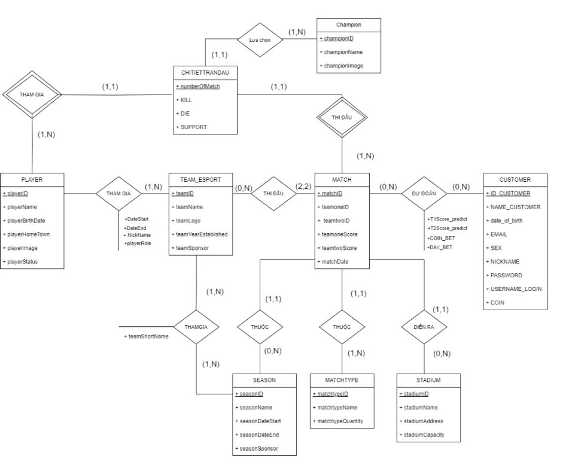
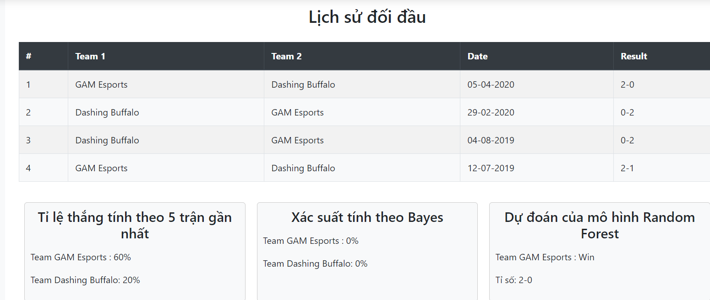

# VCS Information Management Web
## Table of Contents

- [Overview](#overview)
- [Installation](#installation)
- [Usage](#usage)
- [Features](#Features)
- [Contributing](#contributing)
## Overview

This project is a web application designed to allow users to view information about the Vietnam Championship Series (VCS) tournament. The application is built using Node.js and includes an optional machine learning prediction feature.

As we are currently 2nd-year students, some data scraping may be inaccurate, particularly in fields like the date a player joined or left, and the role of a player in a team. Player nicknames, which often change after several seasons, can be difficult to track when scraping from Lolfandom as these changes are usually only reflected in news and communication channels.

The primary aim of this project is to practice the knowledge we've acquired and implement our ideas in a real-world scenario.

<p align="center">
  
</p>

### Components and Workflow

1. **Lolfandom.com**
   - **Scraping**: Data is collected from Lolfandom.com, covering the VCS Spring 2018 to VCS Spring 2024 seasons.

2. **Raw Data**
   - **Storage**: After collection, data is stored in its raw form. This often includes unstructured tables, duplicates, and null values. Some team names may have changed due to sponsorship (e.g., MGN Blue Esport to MGN Box Esports).
   - 
3. **Clean Data**
   - **Preprocess Data**: We used Pandas and Excel to remove duplicates and clean the data. As fans of the League of Legends game, we leveraged our knowledge of the game and the VCS to manually correct errors and ensure data accuracy.
   - **Excel**: Due to difficulties debugging the import function in SQL Server, we decided to use Excel alongside the INSERT INTO function template for easier error detection. The createdata.sql file was generated during this process.

4. **SQL Server**
   - **Relation Schema**: Our idea is to build a website that not only provides information but also includes interactive functions and various interesting parameters.
   - **Grant and hash password**
   - **Create trigger ,function ,procedure**
   - **Create View**
   - The ERD we designed is based on these requirements:  

      

5. **Tableau**
   - **Visualization**: In response to negative information about match-fixing in the tournament, we created graphs to show changes in scores, as well as player numbers and ages over time.
6. **Rest API**
  - **Training**: We utilized scikit learn to train my model.Dataset is consist of seasonid,team1id,team2id and day code. Due to time constraints,but i think you can scarping more data about gold and champion information to get more accurate.The accurate of my model train by random foreset is 67%.The label used during training is the difference between the scores of the two teams, making it a continuous variable.
  - **Flask**: Flask was used to create APIs that respond to requests from the Node.js frontend.
7. **Node JS**
  - Due to limited experience with frontend and backend development, we used Node.js and Bootstrap to build the website following the MVC model.

## Installation

1. **Clone the repository:**

   ```bash
   git clone https://github.com/tuananh1006/VCS-Information-Management-Web.git
   cd VCS-Information-Management-Web

   ```

2. **Install dependencies:**

   `pip install -r requirements.txt`
   `npm install`

3. **Setup environment variables**

   Configure ``` src/config/config.json```

   `"server": "<Your server>",`

   Replace <Your server> with your database server can found in SQL Server Management Studio
   
4. **Setup environment variables**

   Open ```sql_file``` folder:
  
   Execute ```createdatabase.SQL```
   
   After that,execute ```createdata.sql```
## **Usage**
1. **Run the rest api:**
   `python app.py`
2. **Run the Web application:**
   `npm start`
   This command starts a local web server and opens the web application with port 8080.

## **Features**
### **1. View scheduler**

  
  
  
  
### **2. View Ranking**

  
  
  
  
  
  
### **3. View Players**

  
  
  
  
  

### **4. View Team**

  
  
  

### **5. View Dashboard Analytics**
  
  
  
  

### **6. Machine Learning Predict and Recommend**

  
  
  
  
  
  
  
  
## **Contributing**
Contributions are welcome! If you'd like to contribute to this project, please follow these steps:

1. Fork the repository.
2. Create your feature branch **(git checkout -b feature/YourFeature)**.
3. Commit your changes **(git commit -am 'Add some feature')**.
4. Push to the branch **(git push origin feature/YourFeature)**.
5. Open a pull request.

Please ensure your pull request adheres to the code of conduct.
