# VCS Information Management Web
## Table of Contents

- [Overview](#overview)
- [Installation](#installation)
- [Usage](#usage)
- [Contributing](#contributing)
- [Credits](#credits)
## Overview

This project is a web application designed to allow users to view information about Vietnam Championship Series tournament. The application is built using Node.js and includes an optional Machine Learning prediction feature.

Because we are current 2th student, the data scraping can be unaccurate in some feature like at day join and end,role of player in one team,.. The nick name of player is renamed after many season is hard to detect when scarping in lolfandom,because it's normally showed in news and communication channels.  

The project aim to practice the knowledge we have learned and implemented our ideas.

<p align="center">
  
</p>

### Components and Workflow

1. **Lolfandom.com**
   - **Data Sources**: The system begins with data sources from `Lolfandom.com`.
   - **Scraping**: Data is collected from these sources through scraping.I collect from VCS Spring 2018 to VCS Spring 2024.

2. **Raw Data**
   - **Raw Data**: After collection, data is stored in its raw form.Many table not structure and many duplicate as well as null value.Some team is renamed because sponsor like MGN Blue Esport to MGN Box Esports.
   - 
3. **Clean Data**
   - **Preprocess Data**: I use pandas and excel to avoid duplicate in many table.Moreover,as a fan league of legend game, we utilized my knowledge about game and VCS to check that and fix the bug is not matching.
   - **Excel**: Because import function in SQL sever is hard to debug. We decided to use excel and function template INSERT INTO to easily detect error.The ```createdata.sql``` is make from this step. 

4. **SQL Server**
   - **Relation Schema**: My idea is to build a website that, in addition to finding information, must also meet the expected interactive function and have many interesting parameters..
   - So the schema we design like:
  
   - **Grant and hash password**
   - **Create trigger ,function ,procedure**
   - **Create View**
5. **Tableau**
   - From negative information about the tournament about match-fixing, I have an idea to build 
The graph shows the change in score, as well as the number of players and ages.
6. **Rest API**
  - **Training**: We utilized scikit learn to train my model.Dataset is consist of seasonid,team1id,team2id and day code.Because lack of time,but i think you can scarping more data about gold and champion to more accurate.The accurate of my model train by random foreset is 67%.The label of match when training is teamonescore-teamtwoscore it make the label is continious.
  - **Flask**:We use Flask to create api , response the request from node js.
7. **Node JS**
  - Don't have much about knowledge about frontend and backend, we use Node JS and bootstrap to build website follow MVC Model.

## Installation

1. **Clone the repository:**

   ```bash
   git clone https://github.com/tuananh1006/QLTT_APP.git
   cd QLTT_APP

   ```

2. **Install dependencies:**

   `pip install -r requirements.txt`
   `npm install`

3. **Setup environment variables**

   Configure ``` src/config/config.json```

   `"server": "<Your server>",`

   Replace <Your server> with your database server can found in SQL Server Management Studio
   
4. **Setup environment variables**

  Open ```sql_file``` folder:
    - Execute createdatabase.SQL
    - After that,execute createdata.sql
## **Usage**
1. **Run the rest api:**
   `python app.py`
2. **Run the Web application:**
   `npm start`
   This command starts a local web server and opens the web application with port 8080.

## **Features**
**1. View scheduler**
  
  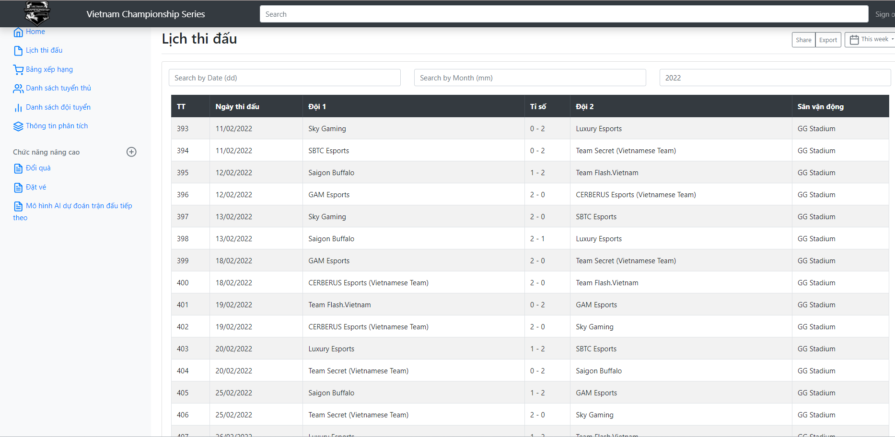
**2. View Ranking**
  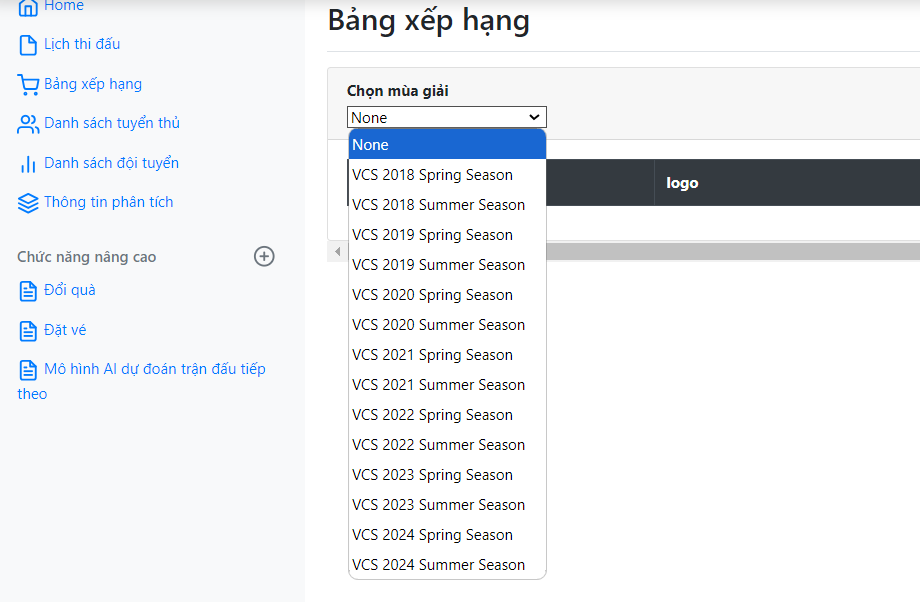
  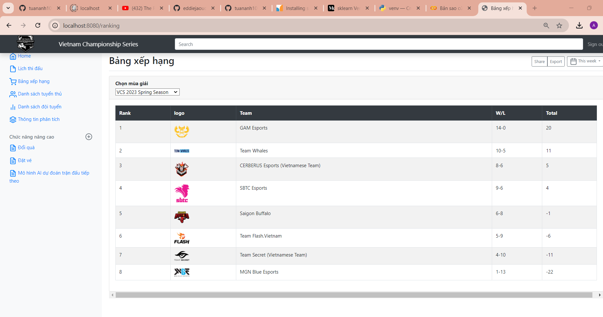
  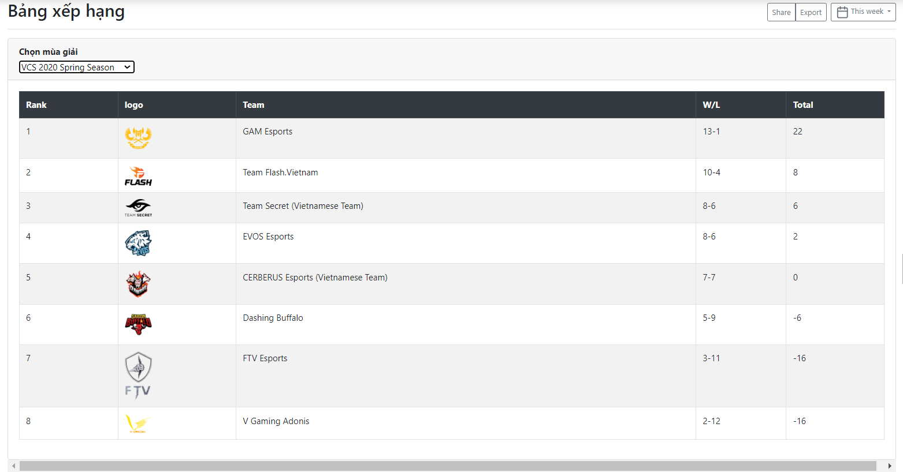
**3. View Players**
  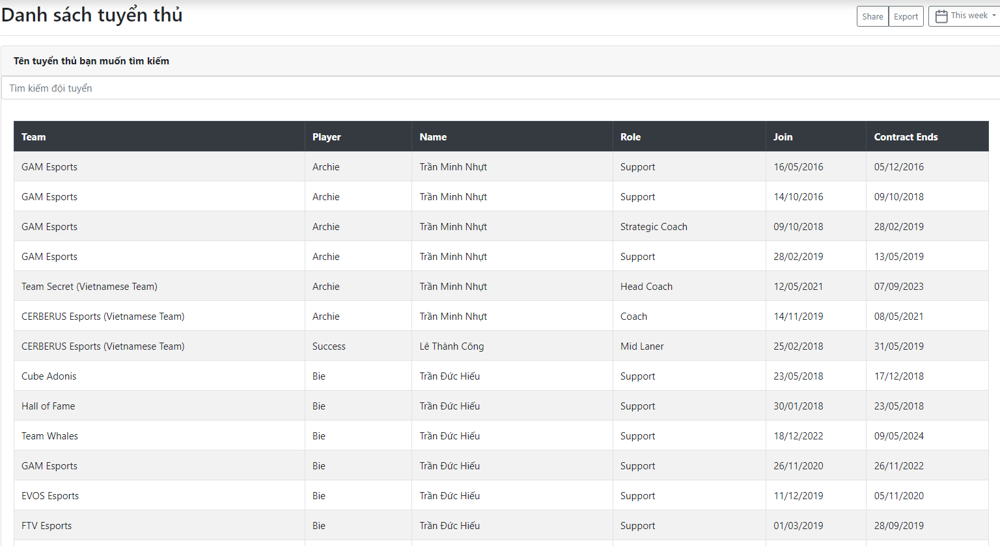
  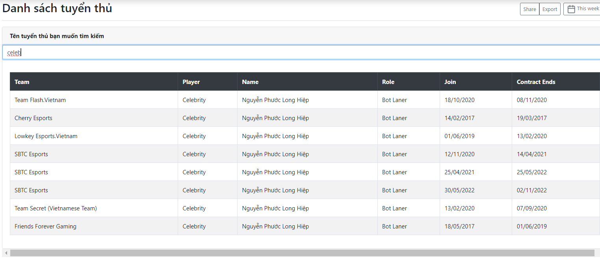
  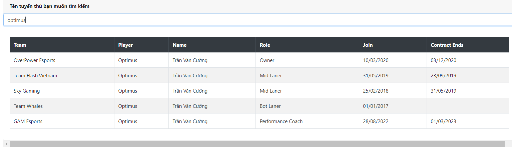
**4. View Team**
  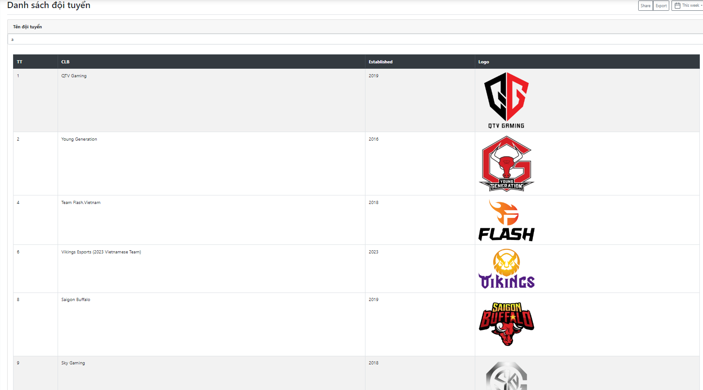
  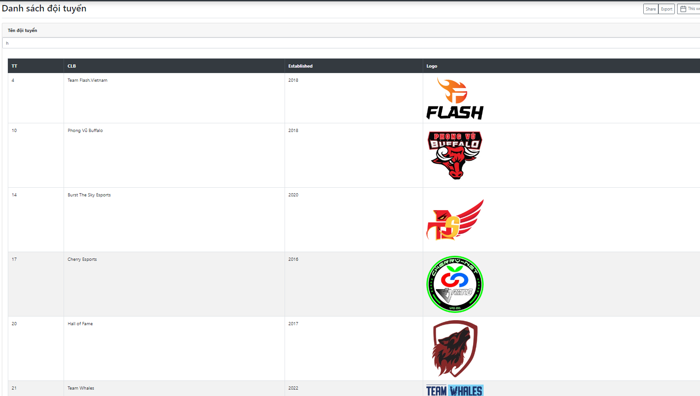
**5. View Dashboard Analytics**
  
  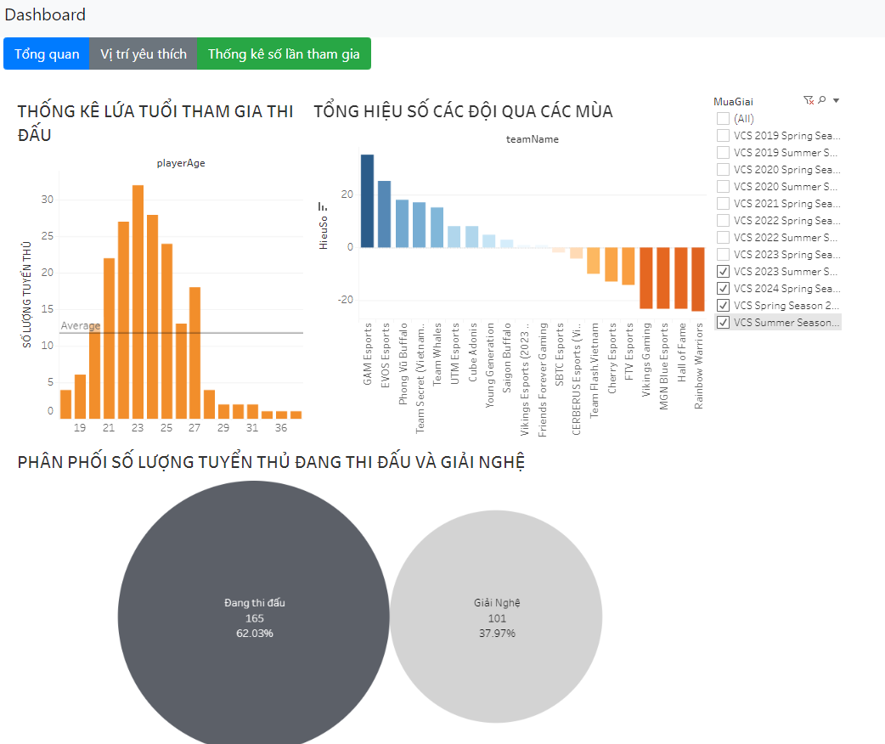
  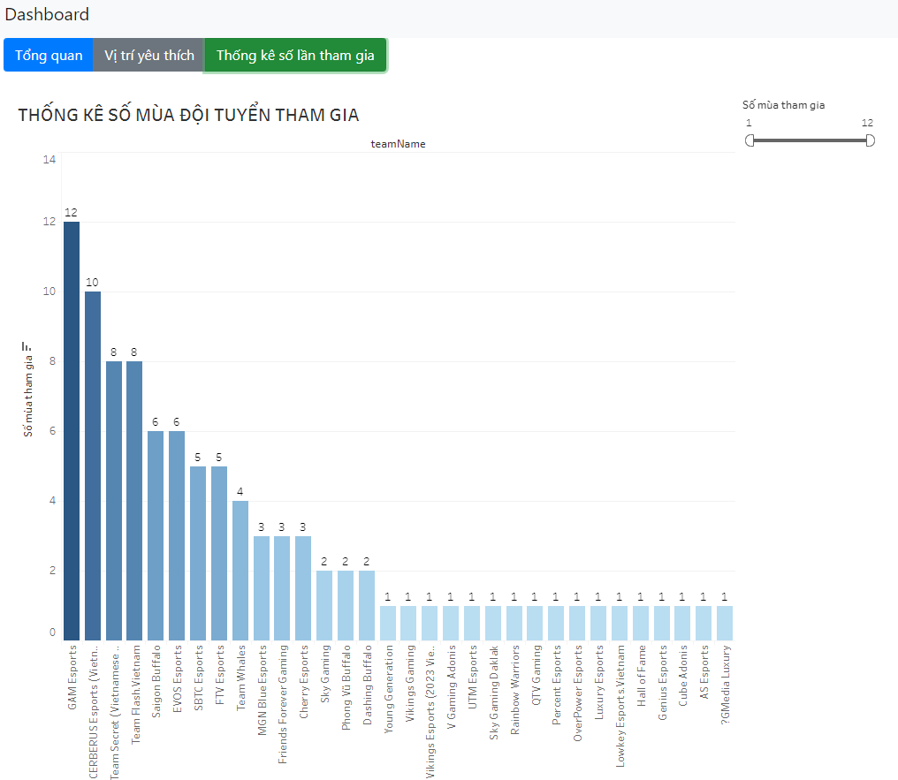
**6. Machine Learning Predict and Recommend**
  
  
  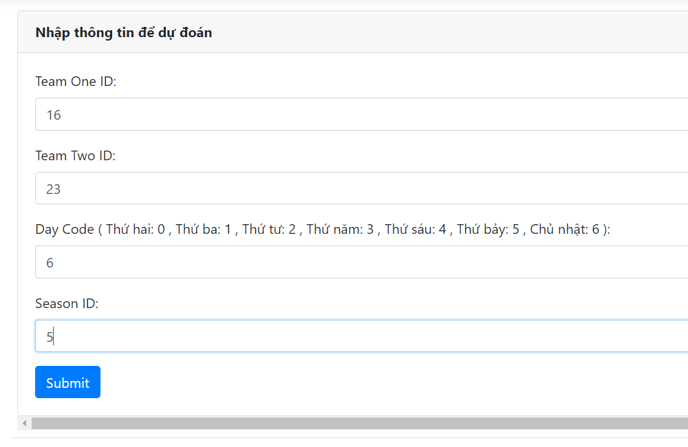
  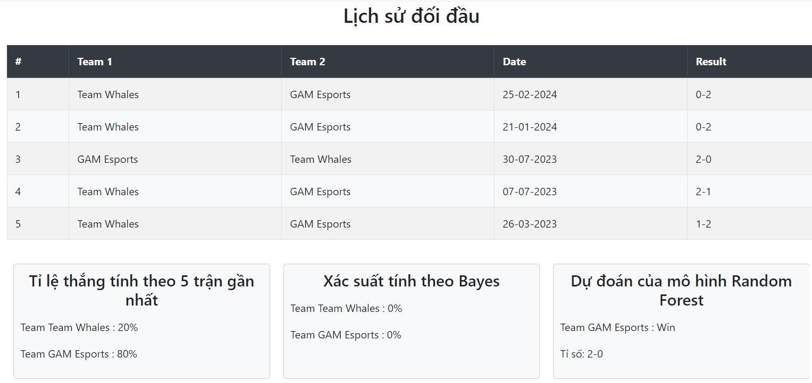
## **Contributing**
Contributions are welcome! If you'd like to contribute to this project, please follow these steps:

1. Fork the repository.
2. Create your feature branch **(git checkout -b feature/YourFeature)**.
3. Commit your changes **(git commit -am 'Add some feature')**.
4. Push to the branch **(git push origin feature/YourFeature)**.
5. Open a pull request.

Please ensure your pull request adheres to the code of conduct.
