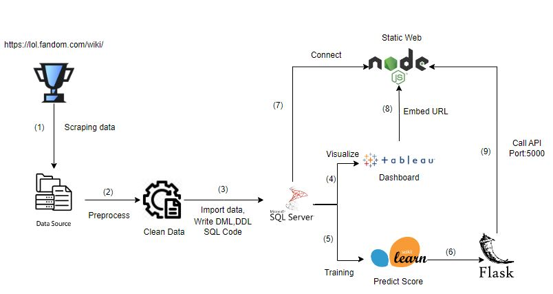

# Product VCS App - SQL, NODEJS, Tableau, ML

### Team Members
1. Nguyen Khanh Tuan Anh - 22520055
2. Trinh Quoc Bao - 22520125
3. Truong Hoai Bao - 22520126
4. Nguyen Vu Nguyen - 22520979

### Architecture

### API - Swagger UI

### Jenkins

### Metrics Monitoring with Prometheus and Grafana

### Jaeger Tracing

### Loggings with Loki and Grafana

**Installation:**

**System Requirements:**

* Operating System: Windows, macOS
* Node.js
* npm 

**Installation Guide:**

1. Install Node.js and npm/yarn if not already installed.
2. Clone the project: `git clone https://github.com/tuananh1006/QLTT_APP.git`
3. Navigate to the project directory: `cd QLTT_app`
4. Install dependencies: `npm install`
5. Open the `/07_22520055_22520125_22520126_22520979.SQL` file in the `sql_file` directory and execute it (you can use ctrl+a and then execute). Then open the `createdata.sql` file, use ctrl+a and execute to load the data.
6. Record the server, driver, and database parameters (including user and password if applicable), then adjust the `config.json` file in the `config` folder accordingly.
7. Start the application: `npm start`
8. Open a new terminal and run `python app.py` to enable the AI prediction feature (optional).

**Key Features:**

* View tournament schedule
* View player information
* View analysis information
...

